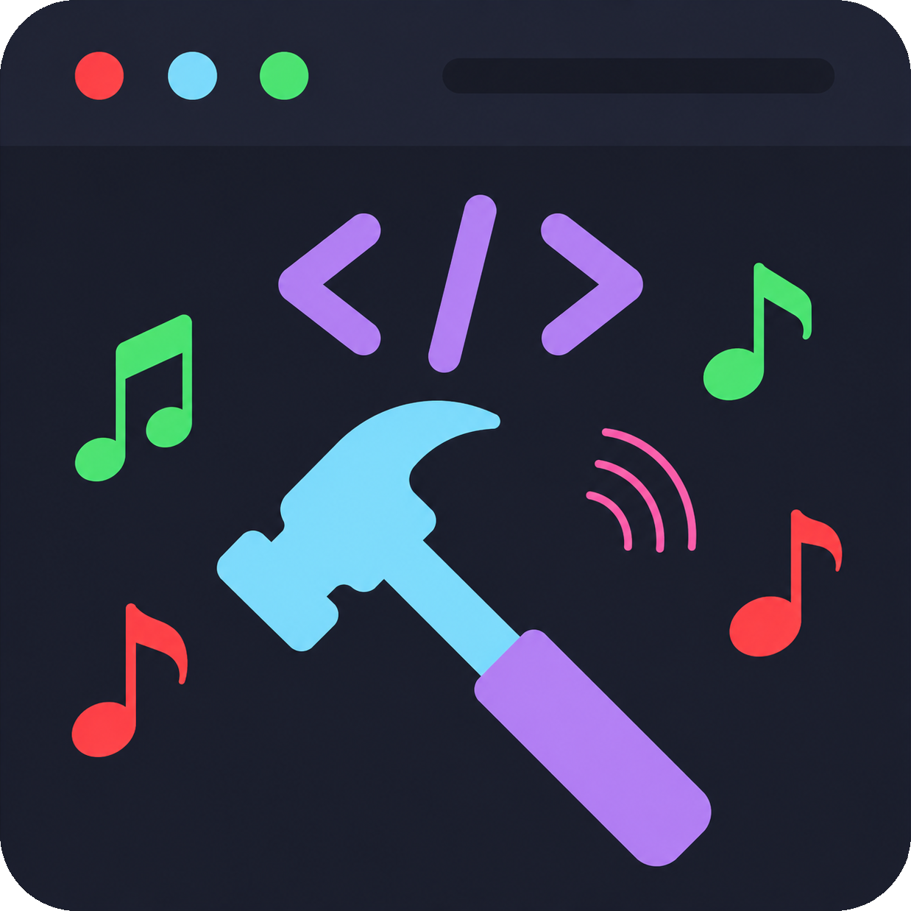

[![Contributors][contributors-shield]][contributors-url]
[![Forks][forks-shield]][forks-url]
[![Stargazers][stars-shield]][stars-url]
[![Issues][issues-shield]][issues-url]
[![License][license-shield]][license-url]

<!-- PROJECT LOGO -->
 

  

  <h3 align="center">BuildBell</h3>

  

    Never miss a build again. BuildBell plays a sound when your Gradle build finishes — so you can multitask without constantly checking Android Studio.
     
     
    <a href="https://github.com/matheus-souza/build-bell/issues/new?labels=bug&template=bug-report---.md">Report Bug</a>
    &middot;
    <a href="https://github.com/matheus-souza/build-bell/issues/new?labels=enhancement&template=feature-request---.md">Request Feature</a>
  

<!-- TABLE OF CONTENTS -->

  
Table of Contents

  <ol>
    <li>
      <a href="#about-the-project">About The Project</a>
      <ul>
        <li><a href="#built-with">Built With</a></li>
      </ul>
    </li>
    <li><a href="#installation">Installation</a></li>
    <li><a href="#supported-versions">Supported Versions</a></li>
    <li><a href="#roadmap">Roadmap</a></li>
    <li><a href="#contributing">Contributing</a></li>
    <li><a href="#license">License</a></li>
    <li><a href="#contact">Contact</a></li>
    <li><a href="#acknowledgments">Acknowledgments</a></li>
  </ol>

<!-- ABOUT THE PROJECT -->
## About The Project

BuildBell is an Android Studio plugin that audibly notifies you when a Gradle build finishes.

- **Success** — plays a success sound effect when the build passes.
- **Failure** — plays a distinct failure sound when the build fails.

Stay focused on other tasks while your build runs. BuildBell will let you know when it's done.

(<a href="#readme-top">back to top</a>)

### Built With

[![Kotlin][kotlin-shield]][kotlin-url]
[![Gradle][gradle-shield]][gradle-url]
[![IntelliJ Platform][intellij-shield]][intellij-url]
[![Android Studio][androidstudio-shield]][androidstudio-url]

(<a href="#readme-top">back to top</a>)

<!-- INSTALLATION -->
## Installation

**Via Android Studio Plugin Marketplace (recommended):**

1. Open Android Studio
2. Go to **Settings → Plugins**
3. Search for **BuildBell**
4. Click **Install** and restart the IDE

**Manual installation:**

1. Download the latest `.zip` from the [Releases](https://github.com/matheus-souza/build-bell/releases) page
2. In Android Studio, go to **Settings → Plugins → ⚙️ → Install Plugin from Disk**
3. Select the downloaded file and restart the IDE

> Make sure your speakers or headphones are connected and the volume is adjusted accordingly.

(<a href="#readme-top">back to top</a>)

<!-- SUPPORTED VERSIONS -->
## Supported Versions

| Android Studio | Version |
|---|---|
| Quail | 2025.4.x |
| Panda | 2025.3.x |
| Otter | 2025.2.x |
| Narwhal | 2025.1.x |
| Meerkat | 2024.3.x |
| Ladybug | 2024.2.x |
| Koala | 2024.1.x |
| Jellyfish | 2023.3.x |
| Iguana | 2023.2.x |
| Hedgehog | 2023.1.x |
| Electric Eel | 2022.x |
| Dolphin | 2021.3.x |

(<a href="#readme-top">back to top</a>)

<!-- ROADMAP -->
## Roadmap

- [ ] Custom sound configuration via Settings UI
- [ ] Per-project enable/disable toggle
- [ ] Visual notification in addition to sound
- [ ] Support for other JetBrains IDEs (IntelliJ IDEA, Fleet)

See the [open issues](https://github.com/matheus-souza/build-bell/issues) for a full list of proposed features and known issues.

(<a href="#readme-top">back to top</a>)

<!-- CONTRIBUTING -->
## Contributing

Contributions are welcome and greatly appreciated.

1. Fork the project
2. Create your feature branch (`git checkout -b feature/AmazingFeature`)
3. Commit your changes (`git commit -m 'Add some AmazingFeature'`)
4. Push to the branch (`git push origin feature/AmazingFeature`)
5. Open a Pull Request

(<a href="#readme-top">back to top</a>)

<!-- LICENSE -->
## License

Distributed under the Apache License 2.0. See `LICENSE` for more information.

(<a href="#readme-top">back to top</a>)

<!-- CONTACT -->
## Contact

Matheus Souza - [matheuhsouza.com.br](https://matheuhsouza.com.br) - mh.matheussouza@gmail.com

Project Link: [https://github.com/matheus-souza/build-bell](https://github.com/matheus-souza/build-bell)

(<a href="#readme-top">back to top</a>)

<!-- ACKNOWLEDGMENTS -->
## Acknowledgments

* [BuildFinishNotifier](https://github.com/WonJoongLee/BuildFinishNotifier) by WonJoongLee — the original project this plugin is based on, licensed under Apache 2.0.
* [Best-README-Template](https://github.com/othneildrew/Best-README-Template) by othneildrew

(<a href="#readme-top">back to top</a>)

<!-- MARKDOWN LINKS & IMAGES -->
[contributors-shield]: https://img.shields.io/github/contributors/matheus-souza/build-bell.svg?style=for-the-badge
[contributors-url]: https://github.com/matheus-souza/build-bell/graphs/contributors
[forks-shield]: https://img.shields.io/github/forks/matheus-souza/build-bell.svg?style=for-the-badge
[forks-url]: https://github.com/matheus-souza/build-bell/network/members
[stars-shield]: https://img.shields.io/github/stars/matheus-souza/build-bell.svg?style=for-the-badge
[stars-url]: https://github.com/matheus-souza/build-bell/stargazers
[issues-shield]: https://img.shields.io/github/issues/matheus-souza/build-bell.svg?style=for-the-badge
[issues-url]: https://github.com/matheus-souza/build-bell/issues
[license-shield]: https://img.shields.io/github/license/matheus-souza/build-bell.svg?style=for-the-badge
[license-url]: https://github.com/matheus-souza/build-bell/blob/main/LICENSE
[kotlin-shield]: https://img.shields.io/badge/Kotlin-7F52FF?style=for-the-badge&logo=kotlin&logoColor=white
[kotlin-url]: https://kotlinlang.org
[gradle-shield]: https://img.shields.io/badge/Gradle-02303A?style=for-the-badge&logo=gradle&logoColor=white
[gradle-url]: https://gradle.org
[intellij-shield]: https://img.shields.io/badge/IntelliJ%20Platform-000000?style=for-the-badge&logo=intellijidea&logoColor=white
[intellij-url]: https://plugins.jetbrains.com/docs/intellij/welcome.html
[androidstudio-shield]: https://img.shields.io/badge/Android%20Studio-3DDC84?style=for-the-badge&logo=androidstudio&logoColor=white
[androidstudio-url]: https://developer.android.com/studio
